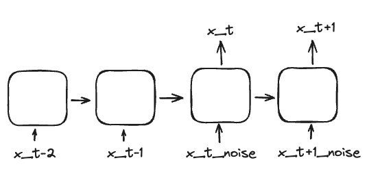

# time_series_diffusion
Exemple code to apply diffusion to time series

We will be applying score based modelling (https://arxiv.org/abs/2011.13456) to time series.

We use a simple architure to do modelling :

